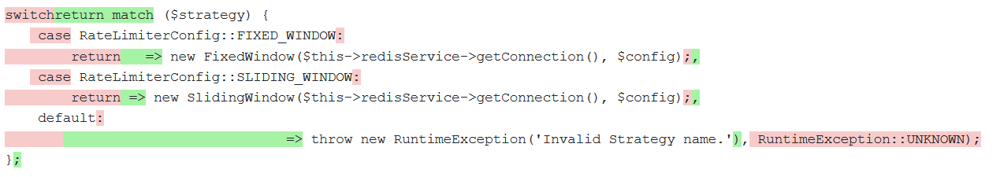
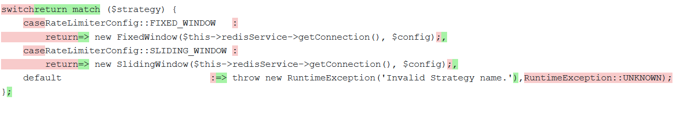
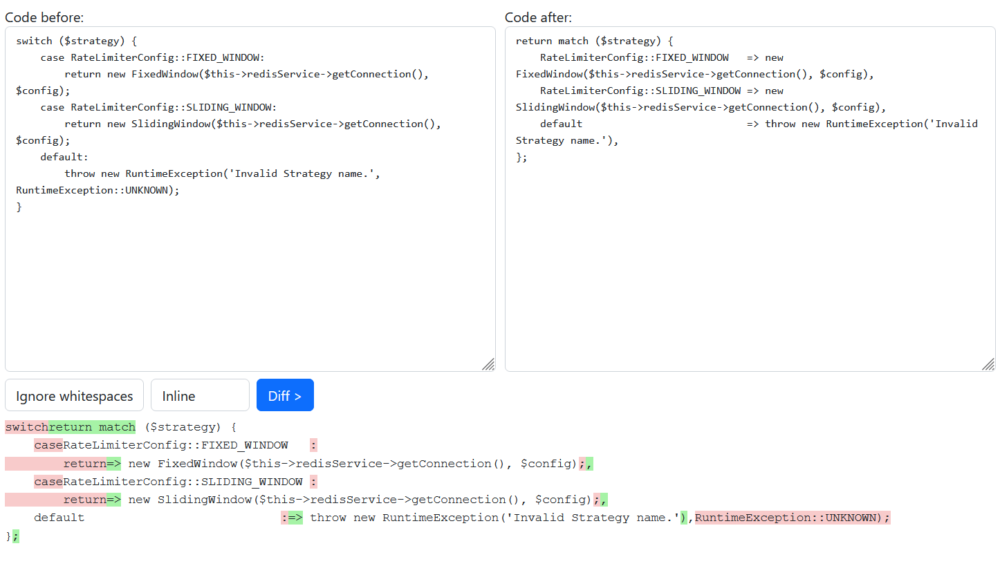

[](https://php.net/)
[](https://www.phpstan.com/)
[](https://app.codecov.io/gh/123inkt/jbdiff)
[](https://github.com/123inkt/jbdiff/actions)


# JBDiff

A multi-line diff calculation library based on Jetbrains' powerful IDE diff implementation.<br>
https://github.com/JetBrains/intellij-community/tree/master/platform/util/diff/src/com/intellij/diff

## Installation
```bash
composer require digitalrevolution/jbdiff
```

## Usage


`$textBefore`:
```php
switch ($strategy) {
    case RateLimiterConfig::FIXED_WINDOW:
        return new FixedWindow($this->redisService->getConnection(), $config);
    case RateLimiterConfig::SLIDING_WINDOW:
        return new SlidingWindow($this->redisService->getConnection(), $config);
    default:
        throw new RuntimeException('Invalid Strategy name.', RuntimeException::UNKNOWN);
}
```
`$textAfter`:
```php
return match ($strategy) {
    RateLimiterConfig::FIXED_WINDOW   => new FixedWindow($this->redisService->getConnection(), $config),
    RateLimiterConfig::SLIDING_WINDOW => new SlidingWindow($this->redisService->getConnection(), $config),
    default                           => throw new RuntimeException('Invalid Strategy name.'),
};
```

To create the diff:
```php
use DR\JBDiff\ComparisonPolicy;
use DR\JBDiff\JBDiff;

// line block will contain all the information to partition the strings in removed, unchanged and added parts.
$lineBlocks = (new JBDiff())->compare($textBefore, $textAfter, ComparisonPolicy::DEFAULT);

// to iterate over the string parts
$iterator = new LineBlockTextIterator($textBefore, $textAfter, $lineBlocks);
```

`$iterator` formatted to html:


with `ComparisonPolicy::IGNORE_WHITESPACES`


### Comparison policies
- `DEFAULT`: the standard diff strategy and will take whitespace differences into account.
- `TRIM_WHITESPACES`: will take leading and trailing whitespaces out of the diff.
- `IGNORE_WHITESPACES`: will take all whitespace differences out of the diff.

## Example
To run the example page, start
```shell
composer run example
```
The page will be available at `http://localhost:8000/`



## About us

At 123inkt (Part of Digital Revolution B.V.), every day more than 50 development professionals are working on improving our internal ERP 
and our several shops. Do you want to join us? [We are looking for developers](https://www.werkenbij123inkt.nl/zoek-op-afdeling/it).
